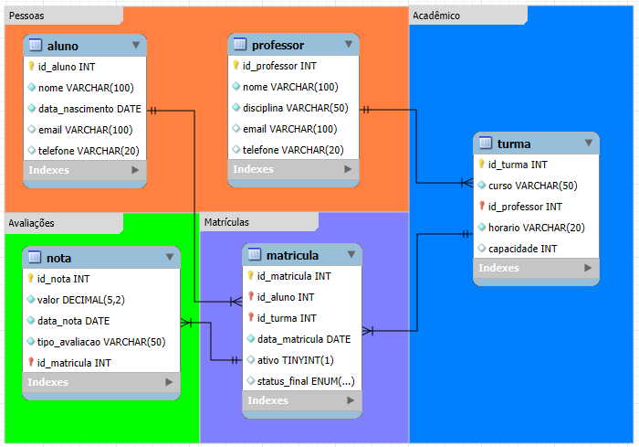

# Atividade Banco de Dados Escolar (simples)

Este projeto consiste em um modelo de banco de dados relacional para uma escola, desenvolvido utilizando MySQL e modelado no MySQL Workbench.

## Estrutura

- `escola.sql`: Script SQL para criação do banco de dados e todas as tabelas, constraints e relacionamentos.
- `DB3_ESCOLA.mwb`: Arquivo do MySQL Workbench com o modelo visual do banco de dados.
- `Modelo.png`: Imagem do diagrama entidade-relacionamento (DER) do banco de dados.

## Entidades e Relacionamentos

O banco de dados é composto pelas seguintes tabelas principais:

- **aluno**: Armazena informações dos alunos (nome, data de nascimento, email, telefone).
- **professor**: Armazena informações dos professores (nome, disciplina, email, telefone).
- **turma**: Representa as turmas, vinculando cada turma a um professor e um curso.
- **matricula**: Registra as matrículas dos alunos nas turmas, com status e data.
- **nota**: Guarda as notas dos alunos em cada matrícula, com tipo de avaliação e data.

Os relacionamentos entre as tabelas garantem integridade referencial e refletem o funcionamento real de uma escola.

## Observações

- Desenvolvemos o modelo seguindo boas práticas de normalização e integridade referencial.
- O campo `status_final` da tabela `matricula` utiliza ENUM para limitar os possíveis status.

---

## Participantes

[Mauricio](github.com/mr1c10) 
[Guilerme](github.com/Guisoares46) 
[Vinicius](github.com/Vini082) 
[Rafael](github.com/Rafalvs)

---

Trabalho desenvolvido para a disciplina de Banco de Dados 3.
